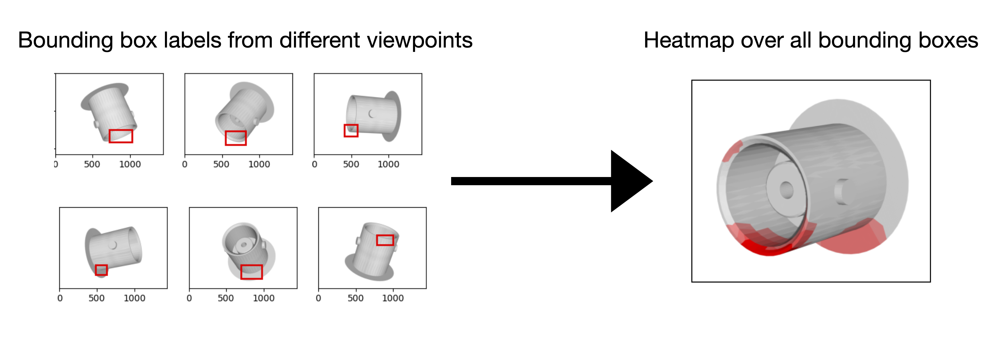
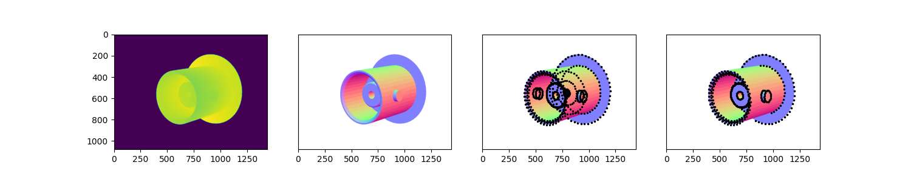
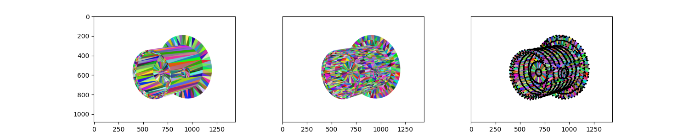
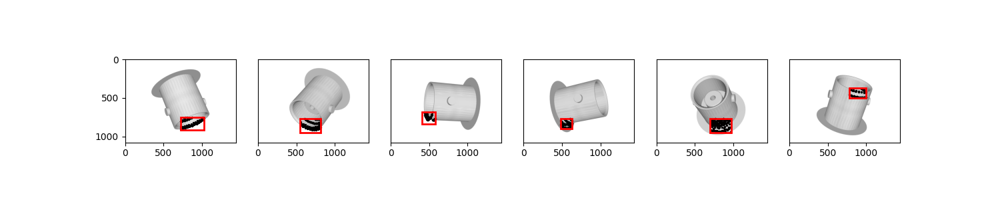
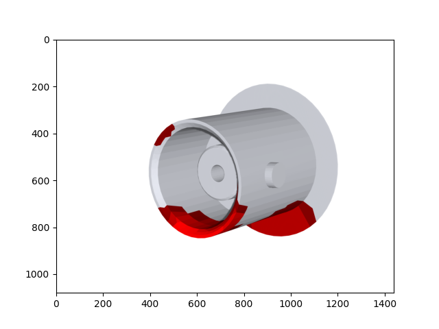

# Annotation_3D

## Task description
Generating a heatmap of annotated failures using annotations from different object viewpoints. In practical use cases, annotated data from users come from different viewpoints because not all failures can be photographed and labeled from the same viewpoint.

## Step 1: Selecting what vertices are visible
All vertices (3rd image) are compared to the depth map (1st image) to show only the visible vertices (4th image).

## Step 2:
In order to show a detailed heatmap, we need to refine the mesh into smaller faces. This is done by cutting in half all triangles with an edge longer than a defined threshold.

## Step 3:
Now we calculate the location of all vertices for any given object pose and check which vertices are inside the bounding boxes.

## Step 4:
The more often the faces' vertices appears in a bounding box, the redder is its color.

